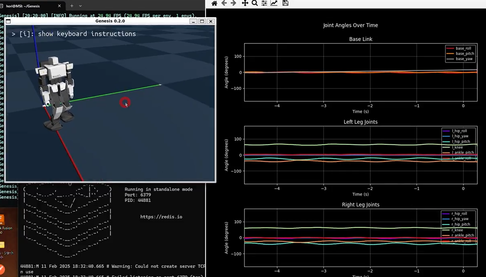
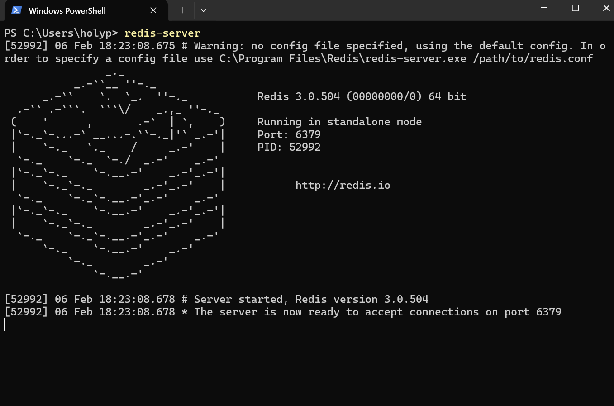

# meridis

`meridis` は Redis をベースとした**ロボット制御データブリッジツール**です。  
シミュレーション、実機ロボット、AIエージェントを共通のデータ構造でシームレスに接続します。

## 目次

- [概要](#概要)
- [Redisのインストール](#redisのインストール)
  - [Windowsの場合](#windowsの場合)
  - [Linux-Ubuntuの場合](#linux-ubuntuの場合)
  - [MacOS版の場合](#macos版の場合)
- [Redisサーバーの動作確認する](#redisサーバーの動作確認する)
  - [ローカルのRedisサーバーにアクセスする場合](#ローカルのredisサーバーにアクセスする場合)
  - [別サブネットのRedisサーバーにアクセスする場合](#別サブネットのredisサーバーにアクセスする場合)
- [Redisキーを作成する](#redisキーを作成する)
  - [コマンド](#コマンド)
  - [動作](#動作)
- [Redisキーを確認する](#redisキーを確認する)


---

## 概要

本リポジトリの**meridis**は、高速なインメモリデータベース **Redis** を共通インターフェースとして、ロボットシミュレーション、実機ロボット、AIエージェントなどの外部システムをシームレスに接続するためのブリッジツール群です。


**対応シミュレータ:**
- ✅ **merimujoco**（MuJoCo ベース）- [リポジトリ](https://github.com/holypong/merimujoco)


- ✅ **Genesis AI**



- ✅ **NVIDIA Isaac Sim**


---
## Redis のインストール

自身の使用環境に合わせてインストール方法を選択してください。

### Windowsの場合

1. 下記サイトからredisインストーラ(msi)をダウンロードする<br>
https://github.com/MicrosoftArchive/redis/releases
1. ダウンロードした「Redis-x64***.msi」をダブルクリックしてredisをインストールする。

### Linux-Ubuntuの場合
1. 下記サイトを確認する
https://www.digitalocean.com/community/tutorials/how-to-install-and-secure-redis-on-ubuntu-20-04-ja
1. ターミナルからコマンドでインストールする
```bash
sudo apt update
sudo apt install redis-server
```

### MacOS版の場合
1. 下記サイトを確認する
https://redis.io/docs/latest/operate/oss_and_stack/install/archive/install-redis/install-redis-on-mac-os/
1. ターミナルからコマンドでインストールする
```bash
brew install redis
```

## Redisサーバーの動作確認する

自身の環境で稼働させているRedisサーバーの状態に合わせて動作確認方法を選択してください。

### ローカルのRedisサーバーにアクセスする場合

- 1つのPC・1つのOSで、Redisサーバーを稼働させているケースを想定


1. Redis-Serverを起動
```bash
redis-server
```


2. Redis-Cliを起動
別ターミナルを開く
```bash
redis-cli

> redis-cli
127.0.0.1:6379> ping
PONG
127.0.0.1:6379> keys *
(empty list or set)
127.0.0.1:6379> exit
```

- Redisのクライアントからサーバーに"ping"を打ったとき"PONG"が返れば導通成功です
- 初回ではRedisのキーは空の状態です。初期状態にしたい場合は以下のコマンドを実行してください
```
> redis-cli
127.0.0.1:6379> flushall
...
127.0.0.1:6379> keys *
(empty list or set)
127.0.0.1:6379> exit
```

- [Redisキーを作成する](#redisキーを作成する)に移動します。


### 別サブネットのRedisサーバーにアクセスする場合

- 1つのPC・2つのOSで、Redisサーバーを稼働させているケースを想定
（例えば、Windows 11 と WSL-Ubuntu を連携させるなど）　

1. Windows Operation
```basj
redis-server
```
2. Windows Operation
```bash
> redis-cli -h 172.21.242.172
172.21.242.172:6379> ping
(error) DENIED Redis is running in protected mode because protected mode is enabled and no password is set for the default user. In this mode connections are only accepted from the loopback interface. 
1) If you want to connect from external computers to Redis you may adopt one of the following solutions: 
2) Alternatively you can just disable the protected mode by editing the Redis configuration file, and setting the protected mode option to 'no', and then restarting the server. 
3) If you started the server manually just for testing, restart it with the '--protected-mode no' option. 
4) Set up an authentication password for the default user. NOTE: You only need to do one of the above things in order for the server to start accepting connections from the outside.

127.0.0.1:6379> exit
```
3. WSL22.04 Operation
```bash
> redis-cli

127.0.0.1:6379> CONFIG GET protected-mode
1) "protected-mode"
2) "yes"

127.0.0.1:6379> CONFIG SET protected-mode no
OK

127.0.0.1:6379> CONFIG GET protected-mode
1) "protected-mode"
2) "no"

127.0.0.1:6379> exit
```

4. Windows Operation
```bash
> redis-cli -h 172.21.242.172

172.21.242.172:6379> ping
PONG

172.21.242.172:6379> keys "*"

127.0.0.1:6379> exit
```

- Redisのクライアントからサーバーに"ping"を打ったとき"PONG"が返れば導通成功です
- 初回ではRedisのキーは空の状態です
- [Redisキーを作成する](#redisキーを作成する) に移動します。


以上を毎回やるのが面倒な場合は、ubuntuのconfを書き換えておくとよい。

```bash
sudo nano /etc/redis/redis.conf

# Redisへの外部サーバからの接続許可設定方法
- bind 127.0.0.1
+ bind 0.0.0.0

#サービスとして起動しておく
- supervised no
+ supervised systemd

# デフォルトはプロテクトがかかっているので外しておく
- protected-mode yes
+ protected-mode no
```

## Redisキーを作成する

**create_meridis_keys.py**

- `create_meridis_keys.py` は Redisサーバーに必要なキーを初期化するためのコマンドラインスクリプトです。
- 起動時にRedisサーバーのIPアドレスを入力し、指定されたRedisキーをハッシュ形式で作成します。
- Meridisシステムのセットアップ時に使用します。

### コマンド
- すでにRedisサーバーが起動している必要があります。
- 起動時にRedisサーバーのIPアドレスが聞かれるので、先ほどのRedis-cliで表示されたIPアドレスを入れてください（通常は`127.0.0.1`）。異なるサブネットのRedisサーバーにアクセスする場合、適切なIPアドレスを入力してください。
- 入力されたIPアドレスでRedisサーバーに接続を試みます。
- キーの初期化は一度だけ行えば十分です。繰り返し実行しても既存キーは上書きされません。

```bash
python create_meridis_keys.py
Enter Redis server IP address: 127.0.0.1

...
All keys created.
```

### 動作
- 以下のキーを順次初期化します：
  - `meridis_sim_pub`
  - `meridis_calc_pub`
  - `meridis_console_pub`
  - `meridis_mgr_pub`
  - `meridis_mcp_pub`
- 各キーは90要素のハッシュとして作成され、全てのフィールドに値0が設定されます。
- キーが既に存在する場合はスキップし、メッセージを表示します。
- 接続に失敗した場合はエラーメッセージを表示してスキップします。

## Redisキーを確認する
```bash
redis-cli
127.0.0.1:6379> ping
PONG
127.0.0.1:6379> keys *
1) "meridis_mcp_pub"
2) "meridis_console_pub"
3) "meridis_mgr_pub"
4) "meridis_calc_pub"
5) "meridis_sim_pub"
127.0.0.1:6379> exit
```
以上でインストールは完了です。  
<BR>  
---

## 📚 さらに詳しく知りたい方へ
研究開発・エンジニアリングを進めるための仕様などの参考資料に続きます。  

**とくにロボット実機を扱う場合は必ず読んでください。**

- **[背景・目的・用語集を読む](README_concept.md)** - なぜmeridis?どんな世界がひろがる?
- **[技術仕様を読む](README_advance.md)** - コマンド・設定ファイル詳細・カスタマイズ方法