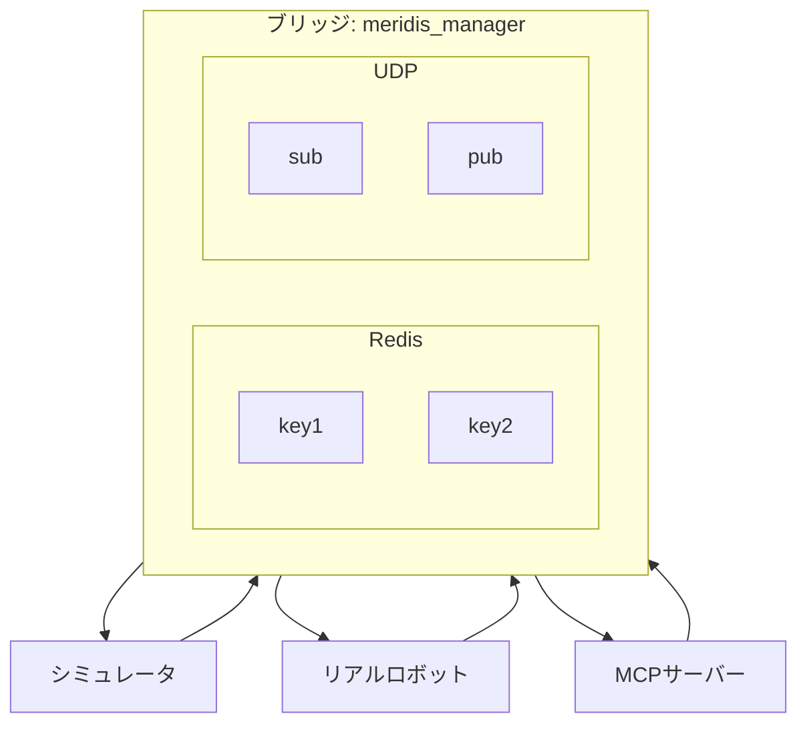
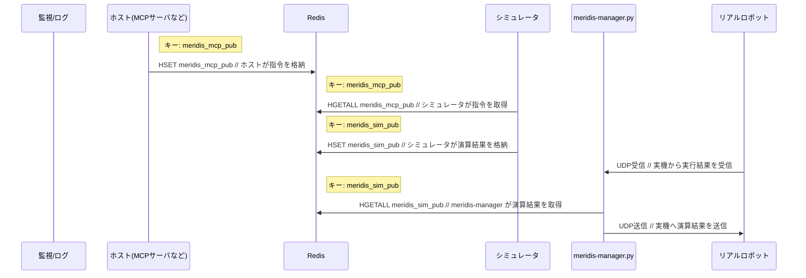
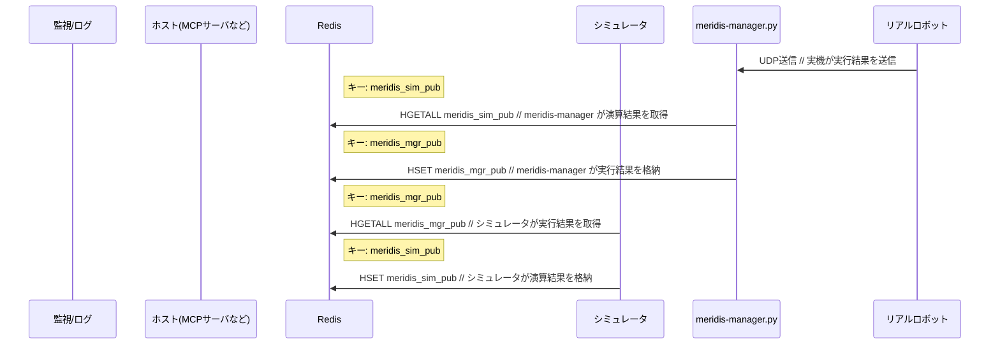
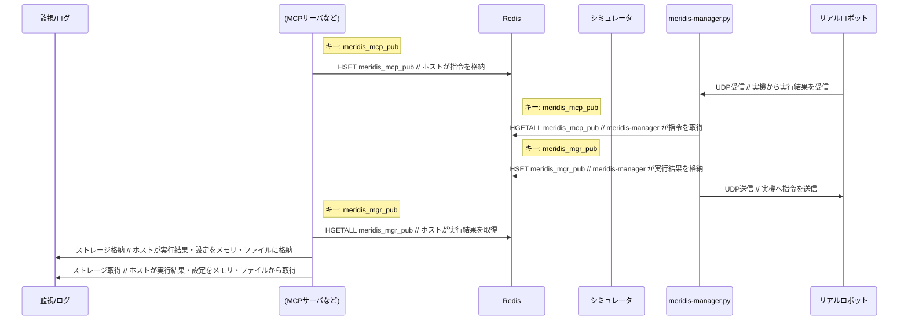

# meridis

`meridis` は Redis をベースとした**ロボット制御データブリッジツール**です。  
シミュレーション、実機ロボット、AIエージェントを共通のデータ構造でシームレスに接続します。

## 目次

- [背景](#背景)
- [目的](#目的)
  - [研究開発](#研究開発)
  - [エンジニアリング](#エンジニアリング)
- [概要](#概要)
- [主な機能](#主な機能)
- [Redisのインストール](#redisのインストール)
  - [Windowsの場合](#windowsの場合)
  - [Linux-Ubuntuの場合](#linux-ubuntuの場合)
  - [MacOS版の場合](#macos版の場合)
- [Redisサーバーの動作確認する](#redisサーバーの動作確認する)
  - [ローカルのRedisサーバーにアクセスする場合](#ローカルのredisサーバーにアクセスする場合)
  - [別サブネットのRedisサーバーにアクセスする場合](#別サブネットのredisサーバーにアクセスする場合)
- [Redisキーを作成する](#redisキーを作成する)
  - [create_meridis_keys.py](#create_meridis_keyspy)
  - [使い方](#使い方)
  - [動作](#動作)
- [Redisキーを確認する](#redisキーを確認する)
- [ロボット動作を管理する](#ロボット動作を管理する)
  - [meridis_manager.py](#meridis_managerpy)
  - [使い方](#使い方-1)
  - [引数](#引数)
  - [動作](#動作-1)
  - [マネージャー設定](#マネージャー設定)
  - [ネットワーク設定](#ネットワーク設定-network)
  - [足の設定](#足の設定foot)
- [ライブラリの詳細](#ライブラリの詳細)
  - [redis_transfer.py](#redis_transferpy)
  - [redis_receiver.py](#redis_receiverpy)
  - [redis_plotter.py](#redis_plotterpy)
- [用語集](#用語集)
  - [基本用語](#基本用語)
  - [ロボット関連用語](#ロボット関連用語)
  - [技術用語](#技術用語)
  - [フィジカルAI関連用語](#フィジカルai関連用語)
  - [シミュレータ関連用語](#シミュレータ関連用語)
  - [meridis 固有用語](#meridis-固有用語)

---

## 背景

- 近年、AIの行動範囲はコンピュータの中だけでなく現実世界にも拡がりはじめました。
- とくに、身体を得て行動し現実世界に物理的に作用するようになったAIを、フィジカルAI(Physical AI)またはエンボディードAI(Embodied AI) と呼びます。
- ロボットを現実世界で動かす前に、何度でも試行を繰り返し、自分と周囲環境を壊すことなく、安全に検証できる、シミュレーション環境の価値が高まっています。
- 従来の方法では、シミュレータごとに異なるインターフェースを実装する必要があり、開発コストが増大し、コードの再利用性も低下していました。
- また、複数のプロセス（シミュレーション、実機制御、AI制御、監視ツール）が同時に同じデータにアクセスし、低遅延で情報をやり取りする仕組みが求められていました。
- **meridis**は、高速インメモリデータベース Redis を共通インターフェースとして使用することで、これらの課題を解決します。

## 目的

### 研究開発

- フィジカルAI・エンボディードAIの研究では、アルゴリズムを現実に近い条件で効率よく検証できることが重要です。
- シミュレーション環境で検証したアルゴリズムを、コードをほとんど変更することなく実機ロボットに適用できれば、研究開発サイクルを大幅に高速化できます。
- **meridis**は、共通のデータ構造（Meridim90フォーマット）と Redis という標準的な技術を組み合わせることで、以下を実現します：
  - シミュレーション環境で検証した制御ロジックを、そのまま実機に適用
  - 複数のシミュレータ（MuJoCo, Genesis, NVIDIA Isaac Sim など）で同じ制御コードを再利用
  - データの記録・再生による再現性の高い実験環境の構築
  - 実機とシミュレーションのデジタルツイン（同期動作）の実現

### エンジニアリング

- ロボット開発では、制御システム、シミュレータ、監視ツール、AIエージェントなど、複数のコンポーネントを統合する必要があります。
- これらのコンポーネント間でデータをやり取りする際、独自プロトコルを実装すると保守性が低下し、拡張が困難になります。
- **meridis**は、Redis という業界標準のインメモリデータベースを共通インターフェースとして使用することで、以下を実現します：
  - AIエージェント（MCPサーバー経由）からの指令を、シミュレーションでも実機でも同じ手順で実行
  - 各コンポーネント（シミュレータ、制御システム、監視ツール）を独立して開発・テスト可能
  - 既存システムとの統合が容易（Redis クライアントライブラリは多くの言語で利用可能）
  - リアルタイム監視・ロギング・デバッグ機能の容易な追加
  - 「考える → 試す → 評価する」という開発ループを、AIエージェントが自動的に実行できる基盤の提供

## 概要

本リポジトリの**meridis**は、高速なインメモリデータベース **Redis** を共通インターフェースとして、ロボットシミュレーション、実機ロボット、AIエージェントなどの外部システムをシームレスに接続するためのブリッジツール群です。

**対応シミュレータ:**
- ✅ **merimujoco**（MuJoCo ベース）- [リポジトリ](https://github.com/holypong/merimujoco)


- ✅ **Genesis AI**


- ✅ **NVIDIA Isaac Sim**


## 主な機能

- **シミュレーションと実機の双方向連携**
  - **Sim2Real**: シミュレーションの制御指令を実機ロボットに送信
  - **Real2Sim**: 実機ロボットの動作をシミュレーションで再現
  - **デジタルツイン**: シミュレーションと実機を同期させて同時動作

- **UDP/Redis ブリッジマネージャー(`meridis_manager.py`）**
  - **Redis**とUDPの組合わせで、ロボットシミュレーション、実機ロボット、AIエージェントなどの外部システムをシームレスに接続するためのブリッジの働きをします。

- **豊富なユーティリティツール**
  - データ転送ライブラリ（`redis_transfer.py`）
  - データ受信ライブラリ（`redis_receiver.py`）
  - リアルタイムデータ可視化ツール（`redis_plotter.py`）

- **共通データ構造（Meridim90）**  
  90要素の数値配列として定義されたロボット制御データフォーマットを提供

- **Redis経由のリアルタイムデータ交換**  
  インメモリデータベースRedis経由で、複数のシステム間で制御データ・状態データを高速に送受信

- **マルチプラットフォーム対応**  
  Windows / Linux / WSL / macOS で動作確認済

---
## Redis のインストール

自身の使用環境に合わせてインストール方法を選択してください。

### Windowsの場合

1. 下記サイトからredisインストーラ(msi)をダウンロードする<br>
https://github.com/MicrosoftArchive/redis/releases
1. ダウンロードした「Redis-x64***.msi」をダブルクリックしてredisをインストールする。

### Linux-Ubuntuの場合
1. 下記サイトを確認する
https://www.digitalocean.com/community/tutorials/how-to-install-and-secure-redis-on-ubuntu-20-04-ja
1. ターミナルからコマンドでインストールする
```bash
sudo apt update
sudo apt install redis-server
```

### MacOS版の場合
1. 下記サイトを確認する
https://redis.io/docs/latest/operate/oss_and_stack/install/archive/install-redis/install-redis-on-mac-os/
1. ターミナルからコマンドでインストールする
```bash
brew install redis
```

# Redisサーバーの動作確認する

自身の環境で稼働させているRedisサーバーの状態に合わせて動作確認方法を選択してください。

## ローカルのRedisサーバーにアクセスする場合

- 1つのPC・1つのOSで、Redisサーバーを稼働させているケースを想定


1. Redis-Serverを起動
```bash
redis-server
```


2. Redis-Cliを起動
別ターミナルを開く
```bash
redis-cli

> redis-cli
127.0.0.1:6379> ping
PONG
127.0.0.1:6379> keys *
(empty list or set)
127.0.0.1:6379> exit
```

- Redisのクライアントからサーバーに"ping"を打ったとき"PONG"が返れば導通成功です
- 初回ではRedisのキーは空の状態です。初期状態にしたい場合は以下のコマンドを実行してください
```
> redis-cli
127.0.0.1:6379> flushall
...
127.0.0.1:6379> keys *
(empty list or set)
127.0.0.1:6379> exit
```

- [Redisキーを作成する](#redisキーを作成する)に移動します。


## 別サブネットのRedisサーバーにアクセスする場合

- 1つのPC・2つのOSで、Redisサーバーを稼働させているケースを想定
（例えば、Windows 11 と WSL-Ubuntu を連携させるなど）　

1. Windows Operation
```basj
redis-server
```
2. Windows Operation
```bash
> redis-cli -h 172.21.242.172
172.21.242.172:6379> ping
(error) DENIED Redis is running in protected mode because protected mode is enabled and no password is set for the default user. In this mode connections are only accepted from the loopback interface. 
1) If you want to connect from external computers to Redis you may adopt one of the following solutions: 
2) Alternatively you can just disable the protected mode by editing the Redis configuration file, and setting the protected mode option to 'no', and then restarting the server. 
3) If you started the server manually just for testing, restart it with the '--protected-mode no' option. 
4) Set up an authentication password for the default user. NOTE: You only need to do one of the above things in order for the server to start accepting connections from the outside.

127.0.0.1:6379> exit
```
3. WSL22.04 Operation
```bash
> redis-cli

127.0.0.1:6379> CONFIG GET protected-mode
1) "protected-mode"
2) "yes"

127.0.0.1:6379> CONFIG SET protected-mode no
OK

127.0.0.1:6379> CONFIG GET protected-mode
1) "protected-mode"
2) "no"

127.0.0.1:6379> exit
```

4. Windows Operation
```bash
> redis-cli -h 172.21.242.172

172.21.242.172:6379> ping
PONG

172.21.242.172:6379> keys "*"

127.0.0.1:6379> exit
```

- Redisのクライアントからサーバーに"ping"を打ったとき"PONG"が返れば導通成功です
- 初回ではRedisのキーは空の状態です
- [Redisキーを作成する](#redisキーを作成する) に移動します。


以上を毎回やるのが面倒な場合は、ubuntuのconfを書き換えておくとよい。

```bash
sudo nano /etc/redis/redis.conf

# Redisへの外部サーバからの接続許可設定方法
- bind 127.0.0.1
+ bind 0.0.0.0

#サービスとして起動しておく
- supervised no
+ supervised systemd

# デフォルトはプロテクトがかかっているので外しておく
- protected-mode yes
+ protected-mode no
```

## Redisキーを作成する

### create_meridis_keys.py
- `create_meridis_keys.py` は Redisサーバーに必要なキーを初期化するためのコマンドラインスクリプトです。
- 起動時にRedisサーバーのIPアドレスを入力し、指定されたRedisキーをハッシュ形式で作成します。
- Meridisシステムのセットアップ時に使用します。

### 使い方
- すでにRedisサーバーが起動している必要があります。
- 起動時にRedisサーバーのIPアドレスが聞かれるので、先ほどのRedis-cliで表示されたIPアドレスを入れてください（通常は`127.0.0.1`）。異なるサブネットのRedisサーバーにアクセスする場合、適切なIPアドレスを入力してください。
- 入力されたIPアドレスでRedisサーバーに接続を試みます。
- キーの初期化は一度だけ行えば十分です。繰り返し実行しても既存キーは上書きされません。

```bash
python create_meridis_keys.py
Enter Redis server IP address: 127.0.0.1

...
All keys created.
```

### 動作
- 以下のキーを順次初期化します：
  - `meridis_sim_pub`
  - `meridis_calc_pub`
  - `meridis_console_pub`
  - `meridis_mgr_pub`
  - `meridis_mcp_pub`
- 各キーは90要素のハッシュとして作成され、全てのフィールドに値0が設定されます。
- キーが既に存在する場合はスキップし、メッセージを表示します。
- 接続に失敗した場合はエラーメッセージを表示してスキップします。

## Redisキーを確認する
```bash
redis-cli
127.0.0.1:6379> ping
PONG
127.0.0.1:6379> keys *
1) "meridis_mcp_pub"
2) "meridis_console_pub"
3) "meridis_mgr_pub"
4) "meridis_calc_pub"
5) "meridis_sim_pub"
127.0.0.1:6379> exit
```

## ロボット動作を管理する
### meridis_manager.py

- `meridis_manager.py` はシミュレーション環境と実機ロボットの間でリアルタイムデータ交換を実現する中核的なブリッジ機能を提供します。
- Mujocoをベースとするシミュレーションプログラム**merimujoco**を公開しています。`meridis_manager.py`と組み合わせる操作手順を「クイックスタート」で説明しています<br>
  https://github.com/holypong/merimujoco


#### アーキテクチャ図



### 使い方

```bash
python meridis_manager.py --mgr MGR_FILE --network NETWORK_FILE --foot FOOT_MODE
```

### 引数

- `--mgr`（デフォルト: `mgr_sim2real.json`）: マネージャー設定 JSON ファイルのパス
- `--network`（デフォルト: `network.json`）: ネットワーク設定 JSON ファイルのパス  
- `--foot`（デフォルト: `off`）: 足部データの 1/100 スケーリング設定（`off`/`on`）

### 動作

- 起動時にマネージャー設定ファイルとネットワーク設定ファイルを読み込みます。設定ファイルが見つからない場合はエラーメッセージを表示してプログラムを終了します。
- マネージャー設定の `data_flow` に基づいて、Redis→UDP、UDP→Redis の各方向でのデータ転送を制御します。
- Redis のハッシュデータ（90要素）を読み取り、Meridim90 バイナリフォーマットに変換して UDP パケットとして送信します。
- UDP で受信した Meridim90 データをパースし、Redis のハッシュとして書き戻します。
- `--foot on` オプション時は、足部関連の特定インデックス範囲（21-47, 46-50, 51-77, 76-80）でのデータに 1/100 スケーリングを適用します。
- 転送処理は継続的なループで実行され、リアルタイムでのデータ同期を実現します。

### マネージャー設定

#### Sim2Real

- `mgr_sim2real.json`

以下は `mgr_sim2real.json` の例です（実際のファイルはリポジトリ内のものを参照してください）：

```json
{
  "redis": {
    "host": "127.0.0.1",
    "port": 6379
  },
  "redis_keys": {
    "read": "meridis_sim_pub",
    "write": "meridis_mgr_pub"
  },
  "data_flow": {
    "redis_to_udp": true,
    "udp_to_redis": false
  }
}
```

以下は典型的なデータフロー（Sim → Real）を Mermaid で表した図です。



### Real2Sim
- `mgr_real2sim.json`

以下は `mgr_real2sim.json` の例です（実際のファイルはリポジトリ内のものを参照してください）：

```json
{
  "redis": {
    "host": "127.0.0.1",
    "port": 6379
  },
  "redis_keys": {
    "read": "meridis_sim_pub",
    "write": "meridis_mgr_pub"
  },
  "data_flow": {
    "redis_to_udp": false,
    "udp_to_redis": true
  }
}
```

以下は典型的なデータフロー（Real → Sim）を Mermaid で表した図です。



### Real
- `mgr_mcp2real.json`

以下は `mgr_mcp2real.json` の例です（実際のファイルはリポジトリ内のものを参照してください）：

```json
{
  "redis": {
    "host": "127.0.0.1",
    "port": 6379
  },
  "redis_keys": {
    "read": "meridis_mcp_pub",
    "write": "meridis_mgr_pub"
  },
  "data_flow": {
    "redis_to_udp": true,
    "udp_to_redis": true
  }
}
```

以下は典型的なデータフロー（MCP → Real、双方向）を Mermaid で表した図です。



### ネットワーク設定 （--network）
- udp
  - PC側からみた送信側・受信側のIP・PORTを設定してください。

```json
{
  "udp": {
    "send": {
      "ip": "192.168.0.21",
      "port": 22224
    },
    "recv": {
      "ip": "192.168.0.23",
      "port": 22222
    }
  }
}
```

### 足の設定(--foot)
足の逆運動学計算の状況をモニタリングするオプションです。足のXYZ位置を登録する処理が入っている場合のみ有用です。

- `off` (デフォルト): 送信用サーボ位置データ（index 21–80 の偶数番）を 100 倍して送信し、受信時は 1/100 に戻す処理を行う（従来動作）

- `on`: 足部分の指定範囲のみ 1/100 スケーリングを行う（コード中の範囲に準拠）

具体的な index 範囲はコードの `write_redis_data()` 内に実装されています。実際の変換ロジックや範囲を確認する場合は `meridis_manager.py` の該当関数を参照してください。

```python
  # --foot on の場合：指定されたrangeのみ1/100する
  for i in range(21, 47, 2):
      data[i] = float(data[i] / 100)
  for i in range(46, 50):   # x,y,z,(r)
      data[i] = float(data[i] / 100) 
  for i in range(51, 77, 2):
      data[i] = float(data[i] / 100)
  for i in range(76, 80):   # x,y,z,(r)
      data[i] = float(data[i] / 100)
```


---
## ライブラリの詳細

- 以降のライブラリの詳細説明は、プログラム開発時の参考としてください。

### redis_transfer.py

- `redis_transfer.py` は Redisサーバーの指定キーにMeridian形式のハッシュデータを書き込むためのデータ転送ユーティリティです。
- 主に他のアプリケーションからライブラリとしてコールされますが、テスト用途で単体実行も可能です。
- Redis接続の動作確認やデータ書き込みのテスト機能を提供します。

#### 使い方

```bash
python redis_transfer.py [--host HOST] [--port PORT] [--key KEY]
```

#### 引数

- `--host`（デフォルト: `localhost`）: Redis サーバーのホスト名またはIPアドレス
- `--port`（デフォルト: `6379`）: Redis サーバーのポート番号
- `--key`（デフォルト: `meridis_calc_hub`）: 書き込み先となる Redis のハッシュキー名

#### 動作

- インスタンス生成時に TCP レベルの接続チェック（`socket.create_connection`）を実行し、その後 Redis の `PING` コマンドで接続確認を行います。接続タイムアウトは 0.5 秒で、到達不能なサーバーに対して迅速に失敗します。
- 指定キーが存在しない場合、90 要素のハッシュ（フィールド名: `"0"`〜`"89"`）を自動初期化します。
- `set_data()` メソッドは 90 要素の数値配列を受け取り、フィールド名を文字列化してハッシュに一括書き込みします。値は数値文字列として保存され、`redis_receiver.py` での `float()` 変換に対応します。
- テスト用の `main()` 関数では、3 回の反復処理で 90 要素のダミーデータを書き込みます。各反復で全要素を 0.1 ずつインクリメントしてデータ変化をシミュレートします。
- 書き込み処理中のエラーは適切にハンドリングされ、エラー内容が標準出力に表示されます。

#### 注記

- ハッシュのフィールド名は文字列の連番（`"0"`, `"1"`, ..., `"89"`）で統一する必要があります。受信側アプリケーションは数値順序での読み取りを前提としています。
- `connect_timeout` および `socket_timeout` パラメータは `RedisTransfer` クラスのコンストラクタで設定可能（デフォルト: 0.5秒）ですが、CLI オプションとしては現在公開されていません。
- データは Meridim90 フォーマット（90要素の数値配列）に準拠することを前提として設計されています。
- ライブラリとして使用する際は、`RedisTransfer` クラスの `set_data()` メソッドで配列データを Redis に転送できます。

### 例

```bash
# ローカルサーバーでデフォルトキーにデータ送信
python redis_transfer.py

Redis list 'meridis_calc_pub' already exists.
Starting data transfer to Redis server localhost:6379 with key 'meridis_calc_pub'
Wrote 90-element hash to 'meridis_calc_pub' (iteration 1)
Wrote 90-element hash to 'meridis_calc_pub' (iteration 2)
Wrote 90-element hash to 'meridis_calc_pub' (iteration 3)
Completed.
```

実装の詳細や利用可能なクラス・メソッドについては [redis_transfer.py](redis_transfer.py) を参照してください（`RedisTransfer`、`set_data`、`check_connection`、`initialize_hash` など）。


### redis_receiver.py

- `redis_receiver.py` は Redisサーバーの指定キーに保存されたMeridian形式のハッシュデータを取得するためのユーティリティです。
- 主に他のアプリケーションからライブラリとしてコールされますが、単体でも実行可能です。
- Redis接続の動作確認やデータ取得のテスト用途にも利用できます。

#### 使い方

```bash
python redis_receiver.py [--host HOST] [--port PORT] [--key KEY] [--window SEC]
```

#### 引数

- `--host`（デフォルト: `localhost`）: Redis サーバーのホスト名またはIPアドレス
- `--port`（デフォルト: `6379`）: Redis サーバーのポート番号
- `--key`（デフォルト: `meridis`）: 取得する Redis のハッシュキー名
- `--window`（デフォルト: `5.0`）: 時系列データの表示時間幅（秒）。内部バッファサイズに影響します

#### 動作

- 起動時に Redis サーバーへの接続テストを実行し、指定キーの存在確認を行います。接続失敗やキー不存在の場合はエラーメッセージを表示して終了します。
- 実装では TCP レベルの接続チェック（`socket.create_connection`）を先行し、その後 Redis の `PING` コマンドで確認します。接続タイムアウトは 0.5 秒で、到達不能なサーバーに対して迅速に失敗します。
- 指定ハッシュキーからデータを読み取り、フィールド名が連番文字列（`"0"`〜`"N-1"`）として格納されている前提で、値を float 型に変換して処理します。
- デフォルトでは 10 回のデータ取得ループを実行し、各ループ間で 0.5 秒待機します。データ要素数と内容を標準出力に表示します。
- Redis接続エラーやデータ変換エラーは適切にハンドリングされ、エラーメッセージとして出力されます。

#### 注記

- Redis ハッシュのフィールドは文字列の連番（`"0"`, `"1"`, ..., `"89"`）で格納される必要があります。受信側は数値順序でソートして値を読み取ります。
- `connect_timeout` および `socket_timeout` パラメータは `RedisReceiver` クラスのコンストラクタで設定可能（デフォルト: 0.5秒）ですが、現在 CLI オプションとしては公開されていません。
- 時系列データ管理機能により、指定された時間ウィンドウ内のデータを効率的にバッファリングします。
- ライブラリとして使用する際は、`RedisReceiver` クラスの `get_data()` メソッドで最新データを取得できます。

#### 例

```bash
# ローカルサーバーでデフォルト設定での動作確認
python redis_receiver.py

Redis server localhost:6379 - starting data retrieval for key 'meridis_calc_pub'
Retrieved data: 90 elements
Data: [0.1, 0.2, 0.3, 0.4, 0.5, 0.6, 0.7, 0.8, 0.9, 1.0, 1.1, 1.2, 1.3, 1.4, 1.5, 1.6, 1.7, 1.8, 1.9, 2.0, 2.1, 2.2, 2.3, 2.4, 2.5, 2.6, 2.7, 2.8, 2.9, 3.0, 3.1, 3.2, 3.3, 3.4, 3.5, 3.6, 3.7, 3.8, 3.9, 4.0, 4.1, 4.2, 4.3, 4.4, 4.5, 4.6, 4.7, 4.8, 4.9, 5.0, 5.1, 5.2, 5.3, 5.4, 5.5, 5.6, 5.7, 5.8, 5.9, 6.0, 6.1, 6.2, 6.3, 6.4, 6.5, 6.6, 6.7, 6.8, 6.9, 7.0, 7.1, 7.2, 7.3, 7.4, 7.5, 7.6, 7.7, 7.8, 7.9, 8.0, 8.1, 8.2, 8.3, 8.4, 8.5, 8.6, 8.7, 8.8, 8.9, 9.0]
...
```

実装の詳細や利用可能なクラス・メソッドについては [redis_receiver.py](redis_receiver.py) を参照してください（`RedisReceiver`、`check_connection`、`get_data`、`get_time_data` など）。


### redis_plotter.py

- `redis_plotter.py` は Redisサーバーに格納されたMeridian形式のハッシュデータをリアルタイムでグラフ表示するためのビジュアライゼーションツールです。
- ロボットの関節角度や足部位置の時系列変化をリアルタイムで監視・デバッグできます。
- matplotlib を使用したアニメーション表示により、データの変化を直感的に把握できます。

#### 使い方

```bash
python redis_plotter.py [--width WIDTH] [--height HEIGHT] [--window WINDOW] [--log on/off] [--redis-key KEY] [--display MODE]
```

#### 引数

- `--width`（デフォルト: `8`）: グラフウィンドウの幅（インチ）
- `--height`（デフォルト: `9`）: グラフウィンドウの高さ（インチ）
- `--window`（デフォルト: `5.0`）: 表示する時間幅（秒）
- `--log`（デフォルト: `off`）: ログ出力の有効/無効（`on`/`off`）
- `--redis-key`（デフォルト: `meridis`）: 読み取るRedisキー名
- `--display`（デフォルト: `joint`）: 表示モード（`joint`: 関節角度表示、`foot`: 足部位置表示）

#### 動作

- 起動時に Redis サーバーへの接続確認を行い、指定したキーの存在確認を実施します。接続できない場合はエラーメッセージを表示して終了します。
- 3つのサブプロット構成で、Base Link（IMU関連）、Right Leg、Left Leg の関節データを同時表示します。
- `joint` モード（デフォルト）では各関節の角度変化をリアルタイムプロットし、`foot` モードでは足部の位置座標（x,y,z）を表示します。
- アニメーション間隔は 10ms で、指定された時間ウィンドウ内のデータを連続表示します。
- ログモード（`--log on`）では、フレームごとにハッシュデータ（インデックス 0-89）をカンマ区切り形式でコンソール出力します。
- 一時停止/再開ボタンによりアニメーションの制御が可能です。

#### 表示内容

**Jointモード（デフォルト）:**
- Base Link: `imu_temp`, `imu_roll`, `imu_pitch`, `imu_yaw`
- Right/Left Leg: `hip_yaw`, `hip_roll`, `thigh_pitch`, `knee_pitch`, `ankle_pitch`, `ankle_roll`

**Footモード:**
- Base Link: 同上
- Foot Position: 左右の足部位置座標（`foot_x`, `foot_y`, `foot_z`）

注記

- ネットワーク設定は `network.json` から自動読み込みされ、Redis接続先が決定されます。設定ファイルが存在しない場合はプログラムを終了します。
- 各関節は Meridim90 配列の特定インデックスにマッピングされており、コード内の `joint_to_meridis` 辞書で管理されています。
- 表示範囲は関節角度が ±90度、IMUデータが ±10度 で固定設定されています。

例

```bash
python redis_plotter.py --width 12 --height 8 --window 10 --log on --display foot
```

実装の詳細や利用可能なクラス・関数については `redis_plotter.py` を参照してください（`RedisPlotter`、`get_joint_data_series`、`update_plot` など）。

---

## 用語集

### 基本用語

**meridis（メリディス）**  
本プロジェクトの名称。Meridim90データフォーマットと Redis を組み合わせた造語で、ロボットシミュレーション、実機ロボット、AIエージェントを共通インターフェースで接続するブリッジツール群。`#Meridian計画`にてholypongが開発。

**Meridim90（メリディム90）**  
ロボット制御データの標準フォーマット。90要素の数値配列として定義され、関節角度、センサー値、制御フラグなどを格納する。Redis ハッシュのフィールド"0"〜"89"として保存され、プロセス間で共有される。

**Redis（レディス）**  
Remote Dictionary Server の略。高速なインメモリ型データベース。プログラム間でデータを瞬時にやり取りするために使用。本プロジェクトでは、シミュレーションと外部システムの橋渡し役として機能。キー・バリュー型データストアとして、ハッシュ、リスト、セットなど多様なデータ構造をサポート。

**MCP（Model Context Protocol）**  
AIエージェントが外部ツールやデータソースと標準的な方法で連携するためのプロトコル。本プロジェクトでは、AIエージェントからロボット制御を実現するために活用（予定）。Anthropic社が提唱する標準規格。

### ロボット関連用語

**Sim2Real（シム・トゥ・リアル）**  
Simulation to Real の略。シミュレーション環境で作成・検証した動作を、実際のロボット（実機）に適用すること。開発効率と安全性の両立に有効。meridis では `mgr_sim2real.json` を使用してこのモードを実現。

**Real2Sim（リアル・トゥ・シム）**  
Real to Simulation の略。実際のロボットの動きやセンサーデータをシミュレーション環境に取り込むこと。実機の動作解析やデバッグに活用。meridis では `mgr_real2sim.json` を使用してこのモードを実現。

**デジタルツイン（Digital Twin）**  
実世界の物体やシステムをデジタル空間に再現したもの。本プロジェクトでは、シミュレーションロボットと実機ロボットが同期して動く状態を指す。双方向データ転送（`redis_to_udp` と `udp_to_redis` の両方を有効化）により実現。

**関節（Joint）**  
ロボットの各可動部分。人間の肩、肘、膝などに相当。各関節には角度や可動範囲が設定される。Meridim90配列では偶数インデックスに目標角度、奇数インデックスに現在角度を格納。

**IMU（Inertial Measurement Unit）**  
慣性計測装置。ロボットの姿勢（傾き）、角速度、加速度を測定するセンサー。本プロジェクトではシミュレーション内で仮想的に算出または実機から取得したデータを Meridim90 配列に格納。

### 技術用語

**インメモリデータベース**  
データをディスクではなくメモリ（RAM）上に保存するデータベース。読み書きが超高速だが、電源を切るとデータが消える（永続化オプションあり）。Redisはこのタイプの代表例。

**ハッシュ（Hash）**  
Redisのデータ構造の一つ。フィールド名と値のペアを複数格納できる。本プロジェクトでは、Meridim90の90要素を "0"〜"89" というフィールド名で格納。`HSET`で書き込み、`HGETALL`で全取得。

**Pub/Sub（パブリッシュ/サブスクライブ）**  
Redisのメッセージング機能。Publisher（発行者）がチャネルにメッセージを送信し、Subscriber（購読者）がそれを受信する。リアルタイム通知やイベント駆動型処理に使用。

**UDP（User Datagram Protocol）**  
インターネットプロトコルの一つ。TCPと異なり、接続確立なしでデータを送信するため高速だが、到達保証がない。ロボット制御では低遅延が重要なため、UDPが使用されることが多い。本プロジェクトでは実機ロボットとの通信に使用。

**JSON（JavaScript Object Notation）**  
設定情報やデータを記述するための軽量なテキスト形式。本プロジェクトではRedis接続設定（`mgr_sim2real.json`）やネットワーク設定（`network.json`）などに使用。人間が読み書きしやすく、プログラムでも扱いやすい。

**ターミナル / コマンドライン**  
文字で命令を入力してプログラムを実行する画面。Windows の PowerShell、macOS/Linux の Terminal など。本ドキュメントでは `python` コマンドや `redis-cli` コマンドの実行に使用。

### フィジカルAI関連用語

**フィジカルAI（Physical AI）**  
物理世界で行動できる身体性を持つAI。ロボットやドローンなど、現実空間で動作するAIシステムを指す。現実的な実装に寄っている。シミュレーションと実機の連携が重要な開発分野。

**エンボディードAI（Embodied AI）**  
身体（Body）を持ち、環境と相互作用しながら学習・行動するAI。フィジカルAIとほぼ同義で使われることが多い。やや研究論文に寄っている。身体性を通じた知能の獲得を重視する AI 研究分野。

**強化学習（Reinforcement Learning）**  
AIが試行錯誤を通じて最適な行動を学習する手法。シミュレーションで大量の試行を繰り返し、実機に適用することが多い。MuJoCo、Genesis、Isaac Sim などのシミュレータと組み合わせて使用される。

### シミュレータ関連用語

**MuJoCo（ムジョコ）**  
Multi-Joint dynamics with Contact の略。ロボットや物体の物理的な動きを高精度にシミュレーションするためのエンジン。DeepMindがオープンソース化し、現在は無料で利用可能。merimujoco の物理エンジンとして使用。

**merimujoco（メリムジョコ）**  
MuJoCo をベースとしたロボットシミュレータで、meridis との連携を前提に設計されている。Redis 経由でデータを送受信し、実機ロボットやAIエージェントとシームレスに接続可能。holypongが開発。

**Genesis（ジェネシス）**  
物理シミュレーションとAIロボティクスを統合した次世代プラットフォーム。MuJoCoをベースに、GPU加速による超高速シミュレーション（最大43万FPS）を実現。生成AI時代のロボット開発に最適化されている。

**NVIDIA Isaac Sim / Isaac Lab（アイザック・シム / アイザック・ラボ）**  
NVIDIAが開発するロボット開発プラットフォーム。Isaac Simはリアルタイムレイトレーシングによるフォトリアリスティックなシミュレーション環境、Isaac Labは強化学習に特化したフレームワーク。内部でMuJoCoを物理エンジンとして利用可能。

### meridis 固有用語

**meridis_manager.py（メリディス・マネージャー）**  
Redis と UDP 間の双方向データ転送を管理するブリッジプログラム。シミュレーション環境と実機ロボットの間でリアルタイムデータ交換を実現する中核的なツール。マネージャー設定ファイル（JSON）で動作モードを切り替え可能。

**redis_transfer.py（レディス・トランスファー）**  
Redis サーバーにデータを書き込むためのライブラリ。Meridim90フォーマットのデータをRedisハッシュに転送する。他のプログラムから `RedisTransfer` クラスとしてインポートして使用可能。

**redis_receiver.py（レディス・レシーバー）**  
Redis サーバーからデータを読み取るためのライブラリ。Redisハッシュに格納されたMeridim90データを取得する。他のプログラムから `RedisReceiver` クラスとしてインポートして使用可能。

**redis_plotter.py（レディス・プロッター）**  
Redis に格納されたロボットデータをリアルタイムでグラフ表示するビジュアライゼーションツール。関節角度や足部位置の時系列変化を監視・デバッグするために使用。matplotlib によるアニメーション表示。

**Redisキー（Redis Key）**  
Redisデータベース内でデータを識別するための名前。本プロジェクトでは以下のキーを使用：
- `meridis_sim_pub`: シミュレータが出力するデータ
- `meridis_calc_pub`: 動作生成プログラムが出力するデータ
- `meridis_console_pub`: コンソールアプリが出力するデータ
- `meridis_mgr_pub`: マネージャーが実機から受信したデータ
- `meridis_mcp_pub`: MCPサーバーが出力するデータ

**data_flow（データフロー）**  
マネージャー設定ファイル内のパラメータ。データの流れる方向を制御：
- `redis_to_udp`: Redis から読み取ったデータを UDP で送信（Sim2Real）
- `udp_to_redis`: UDP で受信したデータを Redis に書き込み（Real2Sim）
- 両方を `true` にすることでデジタルツインモードを実現

---

### さらに詳しく知りたい方へ

- **MuJoCo公式ドキュメント**: https://mujoco.readthedocs.io/
- **Redis公式サイト**: https://redis.io/
- **merimujoco詳細マニュアル**: https://github.com/holypong/merimujoco
- **Model Context Protocol**: https://modelcontextprotocol.io/
- **NVIDIA Isaac Sim**: https://developer.nvidia.com/isaac-sim
- **NVIDIA Isaac Lab**: https://isaac-sim.github.io/IsaacLab/
- **Genesis**: https://genesis-world.readthedocs.io/

