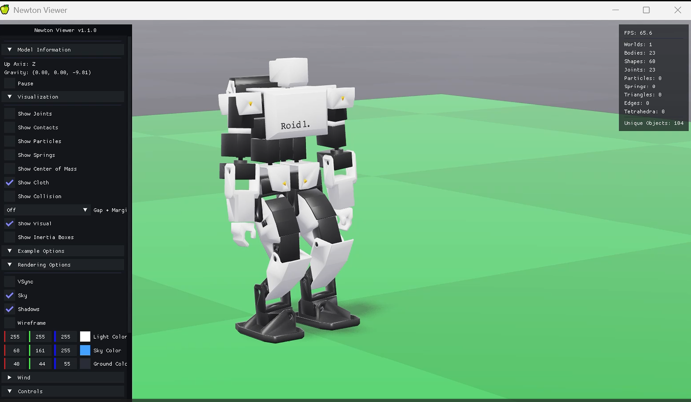

# meridis

English / [Japanese](README.md)

`meridis` is a **robot control data bridge tool based on Redis**.  
It seamlessly connects simulation, real robots, and AI agents using a unified data structure.

## Table of Contents

- [meridis](#meridis)
  - [Table of Contents](#table-of-contents)
  - [Overview](#overview)
  - [Installing Redis](#installing-redis)
    - [Windows](#windows)
    - [Linux (Ubuntu)](#linux-ubuntu)
    - [macOS](#macos)
  - [Verifying the Redis Server](#verifying-the-redis-server)
    - [Accessing a Local Redis Server](#accessing-a-local-redis-server)
    - [Accessing a Redis Server on a Different Subnet](#accessing-a-redis-server-on-a-different-subnet)
  - [Creating Redis Keys](#creating-redis-keys)
    - [Command](#command)
    - [Behavior](#behavior)
  - [Verifying Redis Keys](#verifying-redis-keys)
  - [📚 Further Reading](#-further-reading)
  - [License](#license)


---

## Overview

**meridis** uses the high-speed in-memory database **Redis** as a common interface to seamlessly connect external systems such as robot simulators, real robots, and AI agents.

**Supported Simulators:**
- ✅ **merimujoco** (MuJoCo-based) - https://github.com/holypong/merimujoco


- ✅ **Genesis AI**


- ✅ **NVIDIA Newton**



- ✅ **NVIDIA Isaac Sim (PhysX)**


---

## Installing Redis

Choose the installation method that matches your environment.

### Windows

1. Download the Redis installer (MSI) from the link below:<br>
https://github.com/MicrosoftArchive/redis/releases
2. Double-click the downloaded `Redis-x64***.msi` file to install Redis.

After installation, confirm that Redis commands (`redis-server`, `redis-cli`, etc.) can be run from the command prompt. If they cannot, add the Redis installation directory (typically `C:\Program Files\Redis\`) to your `PATH` environment variable.


### Linux (Ubuntu)

1. Refer to the page below:  
https://www.digitalocean.com/community/tutorials/how-to-install-and-secure-redis-on-ubuntu-20-04
2. Install via terminal:
```bash
sudo apt update
sudo apt install redis-server
```

### macOS

1. Refer to the page below:  
https://redis.io/docs/latest/operate/oss_and_stack/install/archive/install-redis/install-redis-on-mac-os/
2. Install via terminal:
```bash
brew install redis
```

## Verifying the Redis Server

Choose the verification method that matches the state of your Redis server.

### Accessing a Local Redis Server

- Assumes Redis is running on a single PC with a single OS.

1. Check whether Redis Server is already running:
```bash
redis-cli ping
```
- If `PONG` is returned, the server is already running. Skip the startup step.
- If no connection is made, the server is not running — proceed to the next step to start it.

2. Start Redis Server:
```bash
redis-server
```


3. Start Redis CLI (open a new terminal):
```bash
redis-cli

> redis-cli
127.0.0.1:6379> ping
PONG
127.0.0.1:6379> keys *
(empty list or set)
127.0.0.1:6379> exit
```

- If `PONG` is returned when you send `ping` from the Redis client, the connection is successful.
- On first use, Redis keys will be empty. To reset to the initial state, run the following:
```
> redis-cli
127.0.0.1:6379> flushall
...
127.0.0.1:6379> keys *
(empty list or set)
127.0.0.1:6379> exit
```

- Proceed to [Creating Redis Keys](#creating-redis-keys).


### Accessing a Redis Server on a Different Subnet

- Assumes Redis is running on one PC with two operating systems  
  (e.g., Windows 11 and WSL-Ubuntu running together).

1. Windows Operation:
```bash
redis-server
```

2. Windows Operation:
```bash
> redis-cli -h 172.21.242.172
172.21.242.172:6379> ping
(error) DENIED Redis is running in protected mode because protected mode is enabled and no password is set for the default user. In this mode connections are only accepted from the loopback interface. 
1) If you want to connect from external computers to Redis you may adopt one of the following solutions: 
2) Alternatively you can just disable the protected mode by editing the Redis configuration file, and setting the protected mode option to 'no', and then restarting the server. 
3) If you started the server manually just for testing, restart it with the '--protected-mode no' option. 
4) Set up an authentication password for the default user. NOTE: You only need to do one of the above things in order for the server to start accepting connections from the outside.

127.0.0.1:6379> exit
```

3. WSL 22.04 Operation:
```bash
> redis-cli

127.0.0.1:6379> CONFIG GET protected-mode
1) "protected-mode"
2) "yes"

127.0.0.1:6379> CONFIG SET protected-mode no
OK

127.0.0.1:6379> CONFIG GET protected-mode
1) "protected-mode"
2) "no"

127.0.0.1:6379> exit
```

4. Windows Operation:
```bash
> redis-cli -h 172.21.242.172

172.21.242.172:6379> ping
PONG

172.21.242.172:6379> keys "*"

127.0.0.1:6379> exit
```

- If `PONG` is returned when you send `ping` from the Redis client, the connection is successful.
- On first use, Redis keys will be empty.
- Proceed to [Creating Redis Keys](#creating-redis-keys).


If running through these steps every time is inconvenient, you can edit the Ubuntu configuration file to persist the settings:

```bash
sudo nano /etc/redis/redis.conf

# Allow connections from external servers
- bind 127.0.0.1
+ bind 0.0.0.0

# Run as a service
- supervised no
+ supervised systemd

# Disable protected mode
- protected-mode yes
+ protected-mode no
```

## Creating Redis Keys

**create_meridis_keys.py**

- `create_meridis_keys.py` is a command-line script for initializing the required keys on the Redis server.
- At startup, it asks for the Redis server IP address and creates the specified Redis keys in hash format.
- Use this script during Meridis system setup.

### Command

- The Redis server must already be running.
- You will be prompted for the Redis server IP address — enter the address shown in the Redis CLI earlier (usually `127.0.0.1`). For a Redis server on a different subnet, enter the appropriate IP address.
- The script will attempt to connect to the Redis server at the entered IP address.
- Key initialization only needs to be done once. Running it again will not overwrite existing keys.

```bash
python create_meridis_keys.py
Enter Redis server IP address: 127.0.0.1

...
All keys created.
```

### Behavior

- Initializes the following keys in sequence:
  - `meridis_sim_pub`
  - `meridis_calc_pub`
  - `meridis_console_pub`
  - `meridis_mgr_pub`
  - `meridis_ai_pub`
- Each key is created as a hash with 90 fields, all initialized to `0`.
- If a key already exists, it is skipped and a message is displayed.
- If the connection fails, an error message is displayed and the key is skipped.

## Verifying Redis Keys

```bash
redis-cli
127.0.0.1:6379> ping
PONG
127.0.0.1:6379> keys *
1) "meridis_ai_pub"
2) "meridis_console_pub"
3) "meridis_mgr_pub"
4) "meridis_calc_pub"
5) "meridis_sim_pub"
127.0.0.1:6379> exit
```

Installation is now complete.  
<BR>  
---

## 📚 Further Reading

Reference materials for research, development, and engineering.  

**Especially if you are working with a real robot, please read these.**

- **[Background, Purpose & Glossary](README_concept_EN.md)** — Why meridis? What possibilities does it open up?
- **[Technical Specification](README_advance_EN.md)** — Commands, configuration files, and customization

## License

This project is licensed under the MIT License - see the LICENSE file for details.
