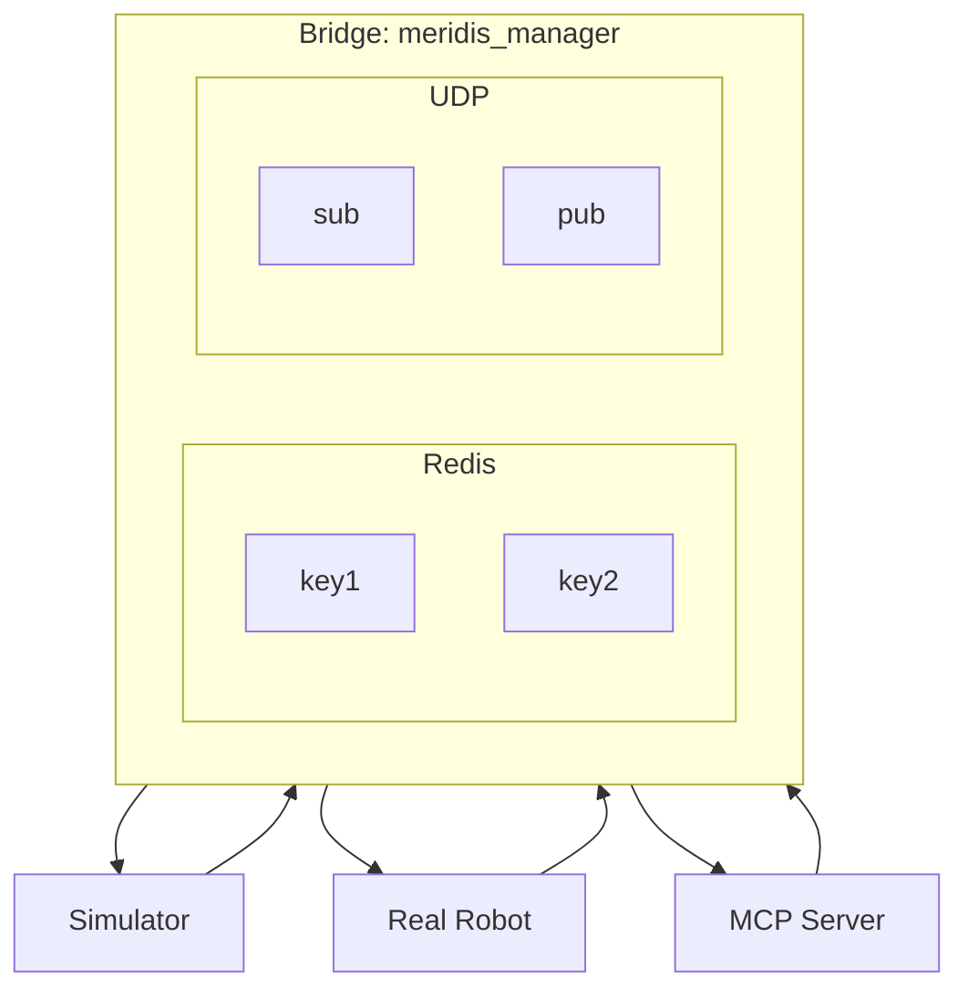
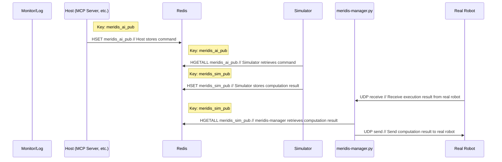
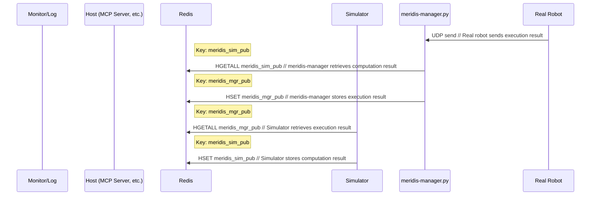
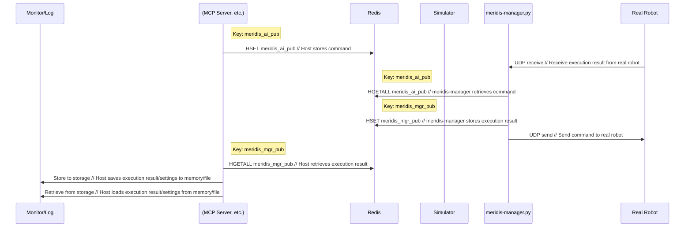

# meridis - Technical Specification

English / [Japanese](README_advance.md)


Detailed technical specifications, configuration file structure, and customization methods for **meridis**.  
If you want to extend the system or run it with custom settings, this is the place to look.  
<BR>

## Table of Contents

- [Specification](#specification)
- [Managing Robot Behavior](#managing-robot-behavior)
  - [Architecture Diagram](#architecture-diagram)
  - [Command](#command)
  - [Options](#options)
  - [Behavior](#behavior)
  - [Manager Option (--mgr)](#manager-option---mgr)
    - [mgr_sim2real.json](#mgr_sim2realjson)
    - [mgr_real2sim.json](#mgr_real2simjson)
    - [mgr_ai2real.json](#mgr_ai2realjson)
  - [Network Option (--network)](#network-option---network)
  - [Foot Option (--foot)](#foot-option---foot)
- [Library Details](#library-details)
  - [Sending Redis Data](#sending-redis-data)
  - [Receiving Redis Data](#receiving-redis-data)
  - [Plotting Redis Data](#plotting-redis-data)


---

## Specification

## Managing Robot Behavior

**meridis_manager.py**

- `meridis_manager.py` provides the core bridge functionality for real-time data exchange between simulation environments and real robots.
- The MuJoCo-based simulation program **merimujoco** is publicly available. The procedure for using it in combination with `meridis_manager.py` is described in the Quick Start guide:<br>
  https://github.com/holypong/merimujoco


### Architecture Diagram



### Command

```bash
python meridis_manager.py --mgr MGR_FILE --network NETWORK_FILE --foot FOOT_MODE
```

### Options

- `--mgr` (default: `mgr_sim2real.json`): Path to the manager configuration JSON file
- `--network` (default: `network.json`): Path to the network configuration JSON file
- `--foot` (default: `off`): Detailed scaling setting for foot position data (`off`/`on`)

### Behavior

- On startup, loads the manager configuration file and network configuration file. If either file is not found, an error message is displayed and the program exits.
- Based on `data_flow` in the manager configuration, controls data transfer in the Redis→UDP and UDP→Redis directions.
- Reads hash data (90 elements) from Redis, converts it to Meridim90 binary format, and sends it as a UDP packet.
- Parses Meridim90 data received via UDP and writes it back to Redis as a hash.
- When `--foot on` is specified, the following scaling is applied:
  - Joint angle data (indices 21, 23, 25, ... 45 and 51, 53, 55, ... 75): 1/100 scaling
  - Left foot position data (indices 46–49): 1/100000 scaling (mm×100 → m conversion)
  - Right foot position data (indices 76–79): 1/100000 scaling (mm×100 → m conversion)
- When `--foot off` is specified, 1/100 scaling is applied to all even indices from 21 to 80.
- The transfer process runs in a continuous loop to achieve real-time data synchronization.


### Manager Option (--mgr)

#### Key Roles

The `--mgr` option uses the following keys. All are HASH type.

| Key | Writer | Reader | Role |
|---|---|---|---|
| `meridis_sim_pub` | Simulator | Real robot / MCP | Simulator-driven control |
| `meridis_calc_pub` | Motion generation program | Simulator / Real robot | Numerical control |
| `meridis_console_pub` | Meridian_console | Simulator / Real robot | Operation from console UI |
| `meridis_mgr_pub` | meridis_manager | Simulator / Real robot / MCP | Real-robot-driven control |
| `meridis_ai_pub` | AI agent + MCP | Simulator / Real robot | AI-driven control |


#### mgr_sim2real.json

If you have a real robot equipped with Meridian, you can synchronize the dance movements of the simulation robot to the real robot.

The following is an example of `mgr_sim2real.json`<br>
(refer to the actual file in the repository):
```json
{
  "redis": {
    "host": "127.0.0.1",
    "port": 6379
  },
  "redis_keys": {
    "read": "meridis_sim_pub",
    "write": "meridis_mgr_pub"
  },
  "data_flow": {
    "redis_to_udp": true,
    "udp_to_redis": false
  }
}
```

The following diagram shows a typical data flow (Sim → Real) in Mermaid:



#### mgr_real2sim.json

If you have a real robot equipped with Meridian, you can reproduce the joint movements of the real robot in the simulation.

The following is an example of `mgr_real2sim.json` (refer to the actual file in the repository):

```json
{
  "redis": {
    "host": "127.0.0.1",
    "port": 6379
  },
  "redis_keys": {
    "read": "meridis_sim_pub",
    "write": "meridis_mgr_pub"
  },
  "data_flow": {
    "redis_to_udp": false,
    "udp_to_redis": true
  }
}
```

The following diagram shows a typical data flow (Real → Sim) in Mermaid:



#### mgr_ai2real.json

If you have a real robot equipped with Meridian, an AI agent can issue commands to the real robot via an MCP server.

The following is an example of `mgr_ai2real.json` (refer to the actual file in the repository):

```json
{
  "redis": {
    "host": "127.0.0.1",
    "port": 6379
  },
  "redis_keys": {
    "read": "meridis_ai_pub",
    "write": "meridis_mgr_pub"
  },
  "data_flow": {
    "redis_to_udp": true,
    "udp_to_redis": true
  }
}
```

The following diagram shows a typical data flow (MCP → Real, bidirectional) in Mermaid:



### Network Option (--network)

- udp
  - Set the IP and port for the send and receive sides as seen from the PC.

- Example `network.json`:
  - send: IP address and port of the real robot<br>
  - recv: IP address and port of the PC

```json
{
  "udp": {
    "send": {
      "ip": "192.168.0.21",
      "port": 22224
    },
    "recv": {
      "ip": "192.168.0.23",
      "port": 22222
    }
  }
}
```

### Foot Option (--foot)

An option to control the scaling of position data based on foot inverse kinematics calculations. Use this when your code includes processing to register foot XYZ positions.

- `off` (default): Applies 1/100 scaling to all servo position data (even-numbered indices 21–80) — legacy behavior.

- `on`: Applies individual scaling to joint angle data and foot position data:
  - Joint angle data (indices 21, 23, 25, ... 45 and 51, 53, 55, ... 75): 1/100 scaling
  - Left foot position data (indices 46–49): 1/100000 scaling (mm×100 → m conversion)
  - Right foot position data (indices 76–79): 1/100000 scaling (mm×100 → m conversion)

The concrete implementation is inside the `write_redis_data()` function in `meridis_manager.py`:

```python
# --foot on: joint angles at 1/100, foot positions at 1/100000 (mm×100 → m)
data[21:47:2] /= 100.0        # joint angles (step of 2)
data[46:50] /= 100000.0       # left foot position x,y,z,r (mm×100 → m)
data[51:77:2] /= 100.0        # joint angles (step of 2)
data[76:80] /= 100000.0       # right foot position x,y,z,r (mm×100 → m)

# --foot off: conventional processing
data[21:81:2] /= 100.0        # all servo position data (step of 2)
```


---

## Library Details

The following library descriptions are provided as reference for program development.

### Sending Redis Data

**redis_transfer.py**

- `redis_transfer.py` is a data transfer utility for writing Meridian-format hash data to a specified key on the Redis server.
- It is primarily called as a library from other applications, but can also be run standalone for testing purposes.
- Provides functionality for verifying Redis connections and testing data writes.

#### Command

```bash
python redis_transfer.py [--host HOST] [--port PORT] [--key KEY]
```

#### Options

- `--host` (default: `localhost`): Hostname or IP address of the Redis server
- `--port` (default: `6379`): Port number of the Redis server
- `--key` (default: `meridis_calc_hub`): Name of the Redis hash key to write to

#### Behavior

- On instantiation, performs a TCP-level connection check (`socket.create_connection`) followed by a Redis `PING` command to verify connectivity. The connection timeout is 0.5 seconds, allowing rapid failure against unreachable servers.
- If the specified key does not exist, automatically initializes a 90-element hash (field names `"0"` through `"89"`).
- The `set_data()` method accepts a 90-element numerical array and writes it to the hash in bulk, with field names converted to strings. Values are stored as numeric strings, compatible with `float()` conversion in `redis_receiver.py`.
- The test `main()` function writes 90-element dummy data across 3 iterations. Each iteration increments all elements by 0.1 to simulate data change.
- Errors during write operations are handled appropriately and displayed on standard output.

#### Notes

- Hash field names must be sequential strings (`"0"`, `"1"`, ..., `"89"`). Receiving applications assume values are read in numeric order.
- The `connect_timeout` and `socket_timeout` parameters can be configured in the `RedisTransfer` class constructor (default: 0.5s), but are not currently exposed as CLI options.
- Data is expected to conform to the Meridim90 format (90-element numerical array).
- When used as a library, array data can be transferred to Redis via the `set_data()` method of the `RedisTransfer` class.

#### Example

```bash
# Send data to the default key on a local server
python redis_transfer.py

Redis list 'meridis_calc_pub' already exists.
Starting data transfer to Redis server localhost:6379 with key 'meridis_calc_pub'
Wrote 90-element hash to 'meridis_calc_pub' (iteration 1)
Wrote 90-element hash to 'meridis_calc_pub' (iteration 2)
Wrote 90-element hash to 'meridis_calc_pub' (iteration 3)
Completed.
```

For implementation details and available classes/methods, refer to [redis_transfer.py](redis_transfer.py) (`RedisTransfer`, `set_data`, `check_connection`, `initialize_hash`, etc.).


### Receiving Redis Data

**redis_receiver.py**

- `redis_receiver.py` is a utility for retrieving Meridian-format hash data stored at a specified key on the Redis server.
- It is primarily called as a library from other applications, but can also be run standalone.
- Can also be used for verifying Redis connections and testing data retrieval.

#### Command

```bash
python redis_receiver.py [--host HOST] [--port PORT] [--key KEY] [--window SEC]
```

#### Options

- `--host` (default: `localhost`): Hostname or IP address of the Redis server
- `--port` (default: `6379`): Port number of the Redis server
- `--key` (default: `meridis`): Name of the Redis hash key to retrieve
- `--window` (default: `5.0`): Time window for time-series data display (seconds). Affects the internal buffer size.

#### Behavior

- On startup, tests the connection to the Redis server and verifies the specified key exists. Displays an error message and exits if the connection fails or the key does not exist.
- The implementation performs a TCP-level connection check (`socket.create_connection`) first, then verifies with a Redis `PING` command. The connection timeout is 0.5 seconds.
- Reads data from the specified hash key and processes the values by converting them to `float` type, assuming field names are stored as sequential strings (`"0"` through `"N-1"`).
- By default, runs a 10-iteration data retrieval loop, waiting 0.5 seconds between each iteration. Displays the number of elements and their values on standard output.
- Redis connection errors and data conversion errors are handled appropriately and displayed as error messages.

#### Notes

- Redis hash fields must be stored as sequential strings (`"0"`, `"1"`, ..., `"89"`). The receiver sorts and reads values in numeric order.
- The `connect_timeout` and `socket_timeout` parameters can be configured in the `RedisReceiver` class constructor (default: 0.5s), but are not currently exposed as CLI options.
- The time-series data management feature efficiently buffers data within the specified time window.
- When used as a library, the latest data can be retrieved via the `get_data()` method of the `RedisReceiver` class.

#### Example

```bash
# Verify operation with default settings on a local server
python redis_receiver.py

Redis server localhost:6379 - starting data retrieval for key 'meridis_calc_pub'
Retrieved data: 90 elements
Data: [0.1, 0.2, 0.3, 0.4, 0.5, 0.6, 0.7, 0.8, 0.9, 1.0, 1.1, 1.2, 1.3, 1.4, 1.5, 1.6, 1.7, 1.8, 1.9, 2.0, 2.1, 2.2, 2.3, 2.4, 2.5, 2.6, 2.7, 2.8, 2.9, 3.0, 3.1, 3.2, 3.3, 3.4, 3.5, 3.6, 3.7, 3.8, 3.9, 4.0, 4.1, 4.2, 4.3, 4.4, 4.5, 4.6, 4.7, 4.8, 4.9, 5.0, 5.1, 5.2, 5.3, 5.4, 5.5, 5.6, 5.7, 5.8, 5.9, 6.0, 6.1, 6.2, 6.3, 6.4, 6.5, 6.6, 6.7, 6.8, 6.9, 7.0, 7.1, 7.2, 7.3, 7.4, 7.5, 7.6, 7.7, 7.8, 7.9, 8.0, 8.1, 8.2, 8.3, 8.4, 8.5, 8.6, 8.7, 8.8, 8.9, 9.0]
...
```

For implementation details and available classes/methods, refer to [redis_receiver.py](redis_receiver.py) (`RedisReceiver`, `check_connection`, `get_data`, `get_time_data`, etc.).


### Plotting Redis Data

**redis_plotter.py**

- `redis_plotter.py` is a visualization tool for displaying Meridian-format hash data stored in Redis as real-time graphs.
- Enables real-time monitoring and debugging of time-series changes in robot joint angles and foot positions.
- Uses matplotlib animations to provide an intuitive view of data changes.

#### Command

```bash
python redis_plotter.py [--width WIDTH] [--height HEIGHT] [--window WINDOW] [--log on/off] [--redis-key KEY] [--display MODE]
```

#### Options

- `--width` (default: `8`): Width of the graph window (inches)
- `--height` (default: `9`): Height of the graph window (inches)
- `--window` (default: `5.0`): Time window to display (seconds)
- `--log` (default: `off`): Enable/disable log output (`on`/`off`)
- `--redis-key` (default: `meridis`): Name of the Redis key to read
- `--display` (default: `joint`): Display mode (`joint`: joint angle display, `foot`: foot position display)

#### Behavior

- On startup, verifies the connection to the Redis server and checks that the specified key exists. Displays an error message and exits if the connection fails.
- Displays three simultaneous subplots: Base Link (IMU-related), Right Leg, and Left Leg joint data.
- In `joint` mode (default), plots real-time angle changes for each joint. In `foot` mode, displays foot position coordinates (x, y, z).
- The animation interval is 10ms, with continuous display of data within the specified time window.
- In log mode (`--log on`), outputs hash data (indices 0–89) in comma-separated format to the console for each frame.
- A pause/resume button allows control over the animation.

#### Display Content

**Joint Mode (default):**
- Base Link: `imu_temp`, `imu_roll`, `imu_pitch`, `imu_yaw`
- Right/Left Leg: `hip_yaw`, `hip_roll`, `thigh_pitch`, `knee_pitch`, `ankle_pitch`, `ankle_roll`

**Foot Mode:**
- Base Link: same as above
- Foot Position: foot position coordinates for left and right feet (`foot_x`, `foot_y`, `foot_z`)

#### Notes

- Network settings are automatically loaded from `network.json` to determine the Redis connection target. The program exits if the configuration file does not exist.
- Each joint is mapped to a specific index in the Meridim90 array, managed by the `joint_to_meridis` dictionary in the code.
- Display ranges are fixed: ±90 degrees for joint angles, ±10 degrees for IMU data.

#### Example

```bash
python redis_plotter.py --width 12 --height 8 --window 10 --log on --display foot
```

For implementation details and available classes/functions, refer to `redis_plotter.py` (`RedisPlotter`, `get_joint_data_series`, `update_plot`, etc.).


## Data Collection Tool: redis_logger.py

A standalone tool that uses a PAD controller button as a trigger to collect data from Redis in real time and save it to `log/logs-YYYYMMDDHHMM.csv`.

### Usage

```bash
python redis_logger.py --btn 1                              # Record while button value = 1
python redis_logger.py --btn 512 --redis redis-mgr.json    # Record with Redis settings for real robot
python redis_logger.py --btn 3 --interval 20               # Polling interval of 20 ms
python redis_logger.py --btn 1 --redis-key meridis_sim_pub # Specify Redis key directly
```

### Options

| Option | Default | Description |
|---|---|---|
| `--btn` | (required) | PAD button value to use as the recording trigger (integer value of Meridim90[15]) |
| `--redis` | `redis.json` | Redis connection configuration JSON file |
| `--redis-key` | `redis_keys.read` from JSON | Redis key to read (retrieved from JSON if omitted) |
| `--interval` | `10.0` ms | Polling interval |

### Behavior

- Accumulates data in the buffer only while the button value matches `--btn`
- Automatically saves to `log/` when the button value changes or the limit (10,000 rows) is reached
- Also saves any remaining buffer on Ctrl+C interruption
- Save format is raw Meridim90 data (no header, 90 columns), same as `buf_input.csv`

---
